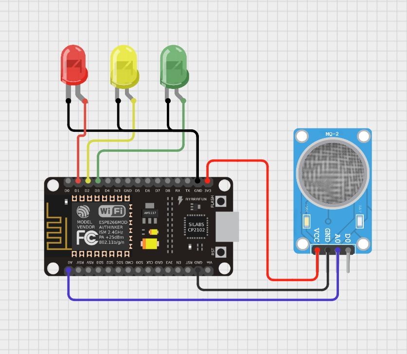

# Pendeteksi Kebocoran Gas Sederhana

Kebocoran gas menjadi masalah yang umum terjadi dalam rumah, 
banyaknya kasus yang terjadi seperti kebakaran dan ledakan yang terjadi akibat adanya kebocoran gas, 
terutama pada tabung gas LPG. Untuk mengatasi masalah tersebut, 
kami membuat alat pendeteksi gas sederhana yang diharapkan bisa mengurangi kejadian yang tidak diinginkan pada pengguna tabung gas LPG.

Proyek Sederhana ini disusun oleh kelompok 6 yang terdiri dari;
- Ammar Nabil Fauzan (2309106006)
- Zhorif Fachdiat (2309106014)
- Adhitya Fajar Al-Huda (2309106027)
- Muhammad Ghazali (2309106041)

### Pembagian Tugas

Agar proyek sederhana ini berjalan lancar, kami melakukan pembagian tugas berdasarkan keahlian masing-masing anggota
- Ammar bertugas untuk mempersiapkan dan merancang alat
- Zhorif sebagai troubleshooter untuk memperbaiki kesalahan yang membuat alat tidak bekerja
- Fajar mempersiapkan dan menyusun dashboard pada platflorm Blynk
- Ghazali mengoding agar data yang diterima sensor bisa dibaca pada serial monitor maupun dashboad Blynk

Komponen yang digunakan pada proyek ini diantaranya;
1. 1 Esp8266
2. 1 Sensor MQ
3. 3 LED (Merah, Kuning, Hijau)
4. 1 Kabel USB to C
5. 9 Kabel jumper

### Board Schematics

  

